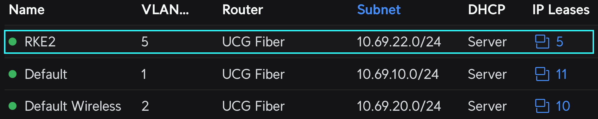

# Simple RKE2 Cluster Install in HA configuration

Goal for this cluster is to be used as a replacement for many-many-many Docker hosts I'm currently running in project [HomeLab](https://github.com/thecubbe/hlab).

Installation components:
- [RKE2](https://docs.rke2.io) - Enterprise-ready next-gen. Kubernetes distribution
- [kube-vip](https://kube-vip.io/) - Provides virtual IP (for HA) and load balancer


## Prerequisites
For this setup we will need 5 linux machines and list of asigned IP addresses.<br/>
I'll be running 5 linux VMs created with [Ubuntu](https://cloud-images.ubuntu.com/) CloudInit templates, on [PVE](https://pve.proxmox.com/)

- 3 VMs will be dedicated rke2 Server nodes (*roles: control-plane, etcd, master*)
- 2 VMs will act as Worker / Agent nodes

| | *Hostname* | *CPU* | *Memory* | *Local IP address* | *VM disk size* | *distro* |
|---| --- | --- | --- | --- | --- | --- |
| **Servers** |`rke2s01` | 4c (1 sockets, 4 cores) | 8 GiB | 10.69.22.**31** | 50 GB | Ubuntu 24.04 amd x64 |
|             |`rke2s02` | 4c (1 sockets, 4 cores) | 8 GiB | 10.69.22.**32** | 50 GB | Ubuntu 24.04 amd x64 |
|             |`rke2s03` | 4c (1 sockets, 4 cores) | 8 GiB | 10.69.22.**33** | 50 GB | Ubuntu 24.04 amd x64 |
| **Agents**  |`rke2a01` | 4c (1 sockets, 4 cores) | 8 GiB | 10.69.22.**41** | 50 GB | Ubuntu 24.04 amd x64 |
|             |`rke2a02` | 4c (1 sockets, 4 cores) | 8 GiB | 10.69.22.**42** | 50 GB | Ubuntu 24.04 amd x64 |

>[!TIP]
>I would suggest creating dedicated VLAN for your cluster and assigning static IP to every instance.<br/>
>
>My dedicated RKE2 cluster VLAN as an example:
>

> **Table of Contents**:
>
> * [Prerequisites](#prerequisites)
> * [Server Node 1](#server-node-1-rke2s01)
>   * [Create RKE2 Config](#create-rke2-configyaml-file-for-our-server-1)
>   * [Spin-up RKE2](#spin-up-rke2)
>   * [Install Kube-vip](#install-kube-vip)
> * [Server Node 2](#server-node-2-rke2s02)
>   * [Create RKE2 Config for 2nd node](#create-rke2-configyaml-file-for-our-server-1)
>   * [Spin-up RKE2 on second node](#spin-up-rke2-on-second-server-node)
> * [Server Node 3](#for-our-3rd-server-node-repeat-steps-from-server-node-2)
> * [Install Kube-vip Loadbalancer](#implement-load-balancer-function-kube-vip-cloud-provider)
> * [Add Agent nodes](#add-agent-nodes-rke2a1--rke2a2)
>
> * [Install Complementary tools](#complementary-tools)


## RKE2 Install
### Server Node #1 `rke2s01`

```bash
# Login to first VM with SSH as a root user
ssh -tt administrator@10.69.22.31 sudo su
```
```bash
# stop the system firewall
systemctl disable --now ufw
```
```bash
# get updates, install nfs, and apply
apt update
apt install nfs-common -y  
apt upgrade -y
```
```bash
# clean up
apt autoremove -y
```

We will begin installing **kube-vip** in parallel with RKE2

Lets first check network interface:
```bash
ip a
```

*Network interface - Output:*

`2: `**eth0**`: <BROADCAST,MULTICAST,UP,LOWER_UP> mtu 1500 qdisc fq_codel state UP group default qlen 1000` <br/>
`    link/ether ab:cd:ef:gh:ij:kl brd ff:ff:ff:ff:ff:ff` <br/>
`    altname enp0s18` <br/>
`    inet 10.69.22.31/24 metric 100 brd 10.69.22.255 scope global dynamic` **eth0** <br/>
`       valid_lft 85664sec preferred_lft 85664sec` <br/>
`    inet6 abcd::efgh:ijkl:mn0p:r5tv/64 scope link` <br/>
`       valid_lft forever preferred_lft forever` <br/>  
  

Find out the latest version of the kube-vip release by parsing the GitHub API

```bash
curl -sL https://api.github.com/repos/kube-vip/kube-vip/releases | jq -r ".[0].name"
```

*Latest version - Output:* `v0.9.2` <br/>
<sub>*as of 07/2025*</sub>


Declare variables for virtual IP, server nodes IPs, network interface and kube-vip version
> make sure your selected virtual ip is free (*not assigned to any device/VM*) and outside of DHCP pool

```bash 
export RKE2_API_VIP=10.69.22.10        # kube-vip virtual IP 
export RKE2_SERVER_01_IP=10.69.22.31   # rke2s01
export RKE2_SERVER_02_IP=10.69.22.32   # rke2s02
export RKE2_SERVER_03_IP=10.69.22.33   # rke2s03
export NETWORK_INTERFACE=eth0          # interface name
export KVVERSION=v0.9.2                # version of the kube-vip release
```


Get and modify official RKE2 install script

```bash 
curl -sfL https://get.rke2.io --output install.sh

chmod +x install.sh

sudo mkdir -p /etc/rancher/rke2/
```


### Create RKE2 config.yaml file for our Server #1 
```bash 
cat <<EOF | tee /etc/rancher/rke2/config.yaml
node-name:
  - "rke2s01"
token: Your-Shared-Secret 
tls-san:
  - ${RKE2_API_VIP}
  - ${RKE2_SERVER_01_IP}
  - ${RKE2_SERVER_02_IP}
  - ${RKE2_SERVER_03_IP}
etcd-extra-env: TZ=Europe/Vienna
kube-apiserver-extra-env: TZ=Europe/Vienna
kube-controller-manager-extra-env: TZ=Europe/Vienna
kube-proxy-extra-env: TZ=Europe/Vienna
kube-scheduler-extra-env: TZ=Europe/Vienna
cloud-controller-manager-extra-env: TZ=Europe/Vienna
EOF
```

> [!IMPORTANT]
>If you do not specify a pre-shared secret ("token:"), RKE2 will generate one and place it at:<br/>
>`/var/lib/rancher/rke2/server/node-token`.


```bash
# Check config:
cat /etc/rancher/rke2/config.yaml
```

> <br/>
>Edited config.yaml file should look something like this:

```yaml
node-name:
  - "rke2s01"
token: Your-Shared-Secret 
tls-san:
  - 10.69.22.10
  - 10.69.22.31
  - 10.69.22.32
  - 10.69.22.33
etcd-extra-env: TZ=Europe/Vienna
kube-apiserver-extra-env: TZ=Europe/Vienna
kube-controller-manager-extra-env: TZ=Europe/Vienna
kube-proxy-extra-env: TZ=Europe/Vienna
kube-scheduler-extra-env: TZ=Europe/Vienna
cloud-controller-manager-extra-env: TZ=Europe/Vienna
```


### **Spin-up RKE2:**
```bash
sudo INSTALL_RKE2_CHANNEL=stable ./install.sh

export PATH=$PATH:/opt/rke2/bin

# start and enable for restarts - 
systemctl enable --now rke2-server.service
```

**copy kubeconfig**
```bash
mkdir ~/.kube

sudo cp /etc/rancher/rke2/rke2.yaml ~/.kube/config

sudo cp /var/lib/rancher/rke2/bin/* /usr/local/bin/

sudo cp /opt/rke2/bin/* /usr/local/bin/
```

```bash 
kubectl get node
```  


### Install Kube-vip
Get kube-vip RBAC
```bash
curl https://kube-vip.io/manifests/rbac.yaml > /var/lib/rancher/rke2/server/manifests/kube-vip-rbac.yaml
```

```bash 
/var/lib/rancher/rke2/bin/crictl -r "unix:///run/k3s/containerd/containerd.sock"  pull ghcr.io/kube-vip/kube-vip:$KUBE_VIP_VERSION
```
```bash 
CONTAINERD_ADDRESS=/run/k3s/containerd/containerd.sock  ctr -n k8s.io run \
--rm \
--net-host \
ghcr.io/kube-vip/kube-vip:$KVVERSION vip /kube-vip manifest daemonset --arp --interface $NETWORK_INTERFACE --address $RKE2_API_VIP --controlplane  --leaderElection --taint --services --inCluster | tee /var/lib/rancher/rke2/server/manifests/kube-vip.yaml
```

**Check if kube-vip-ds pod is normal**
```bash 
ubectl -n kube-system get po
```   
> [!IMPORTANT]
>Check your network interface -> there should be an additional IP assigned, representing virtual IP of our cluster

```bash
ip a
```


*Now it should look like this:*

`2: eth0: <BROADCAST,MULTICAST,UP,LOWER_UP> mtu 1500 qdisc fq_codel state UP group default qlen 1000` <br/>
`    link/ether ab:cd:ef:gh:ij:kl brd ff:ff:ff:ff:ff:ff` <br/>
`    altname enp0s18 <br/>` <br/>
`    inet 10.69.22.31/24 metric 100 brd 10.69.22.255 scope global dynamic eth0` <br/>
`       valid_lft 85664sec preferred_lft 85664sec` <br/>
**`    inet 10.69.22.10/24 metric 100 scope global dynamic eth0`** <br/>
`       valid_lft 85664sec preferred_lft 85664sec` <br/>
`    inet6 abcd::efgh:ijkl:mn0p:r5tv/64 scope link` <br/>
`       valid_lft forever preferred_lft forever` <br/>


## Server Node #2 `rke2s02`

```bash
Login to the second VM as a root use
ssh -tt administrator@10.69.22.32 sudo su
```
```bash
# stop the system firewall
systemctl disable --now ufw
```
```bash
# get updates, install nfs, and apply
apt update
apt install nfs-common -y  
apt upgrade -y
```
```bash
# clean up
apt autoremove -y
```

Declare variables for our second Server node

```bash 
export RKE2_API_VIP=10.69.22.10        # kube-vip virtual IP 
export RKE2_SERVER_01_IP=10.69.22.31   # rke2s01
export RKE2_SERVER_02_IP=10.69.22.32   # rke2s02
export RKE2_SERVER_03_IP=10.69.22.33   # rke2s03
export NETWORK_INTERFACE=eth0          # interface name
export KVVERSION=v0.9.2                # version of the kube-vip release
```


Get and modify official RKE2 install script

```bash 
curl -sfL https://get.rke2.io --output install.sh

chmod +x install.sh

sudo mkdir -p /etc/rancher/rke2/
```


### Create RKE2 config.yaml file for our Server #2
```bash 
cat <<EOF | tee /etc/rancher/rke2/config.yaml
server: https://${RKE2_API_VIP}:9345
node-name:
  - "rke2s02"
token: Your-Shared-Secret 
tls-san:
  - ${RKE2_API_VIP}
  - ${RKE2_SERVER_01_IP}
  - ${RKE2_SERVER_02_IP}
  - ${RKE2_SERVER_03_IP}
etcd-extra-env: TZ=Europe/Vienna
kube-apiserver-extra-env: TZ=Europe/Vienna
kube-controller-manager-extra-env: TZ=Europe/Vienna
kube-proxy-extra-env: TZ=Europe/Vienna
kube-scheduler-extra-env: TZ=Europe/Vienna
cloud-controller-manager-extra-env: TZ=Europe/Vienna
EOF
```

> [!IMPORTANT]
> Secret / token must be the same as in our `rke2s01` instance


```bash
# Check config:
cat /etc/rancher/rke2/config.yaml
```

> <br/>
>Edited config.yaml file should look something like this:

```yaml
server: https://10.69.22.10:9345
node-name:
  - "rke2s02"
token: Your-Shared-Secret 
tls-san:
  - 10.69.22.10
  - 10.69.22.31
  - 10.69.22.32
  - 10.69.22.33
etcd-extra-env: TZ=Europe/Vienna
kube-apiserver-extra-env: TZ=Europe/Vienna
kube-controller-manager-extra-env: TZ=Europe/Vienna
kube-proxy-extra-env: TZ=Europe/Vienna
kube-scheduler-extra-env: TZ=Europe/Vienna
cloud-controller-manager-extra-env: TZ=Europe/Vienna
```


### **Spin-up RKE2 on second server node:**
```bash
sudo INSTALL_RKE2_CHANNEL=stable ./install.sh

export PATH=$PATH:/opt/rke2/bin

# start and enable for restarts - 
systemctl enable --now rke2-server.service
```

**copy kubeconfig**
```bash
mkdir ~/.kube

sudo cp /etc/rancher/rke2/rke2.yaml ~/.kube/config

sudo cp /var/lib/rancher/rke2/bin/* /usr/local/bin/

sudo cp /opt/rke2/bin/* /usr/local/bin/
```

```bash 
kubectl get node
```  


## For our 3rd Server node repeat steps from [Server Node #2](#server-node-2-rke2s02) 

> [!WARNING]
> Dont forget to change the "node-name" in config.yaml
  
```yaml
node-name:
  - "rke2s03"
```  


## Implement Load Balancer function (kube-vip-cloud-provider)

```bash
kubectl apply -f https://raw.githubusercontent.com/kube-vip/kube-vip-cloud-provider/main/manifest/kube-vip-cloud-controller.yaml
```

```bash
kubectl -n kube-system get po -l app=kube-vip
```

### Create an IP range for kube-vip load balancer
* My selected range is `10.69.22.100-10.69.22.200`

```bash
kubectl create configmap --namespace kube-system kubevip --from-literal range-global=10.69.22.100-10.69.22.200
```


## Add Agent nodes `rke2a1` & `rke2a2`

```yaml
token: coming soon... :)
```


# Complementary tools

* [Install cert-manager](https://github.com/thecubbe/HomeLab/RKE2/Traefik-Cert-manager)
  * [cert-manager](https://cert-manager.io) - Cloud native certificate management
* [Install Traefik](https://github.com/thecubbe/HomeLab/RKE2/Traefik-Cert-manager)
  * [traefik](https://traefik.io/traefik) - Reverse proxy and ingress controller 
* [Install Rancher](https://github.com/thecubbe/HomeLab/RKE2/Rancher)
  * [Rancher](https://www.suse.com/products/suse-rancher/) - Multi-Cluster Kubernetes Management
* [Install Longhorn](https://github.com/thecubbe/HomeLab/RKE2/Longhorn)
  * [Longhorn](https://longhorn.io) - Unified storage layer


